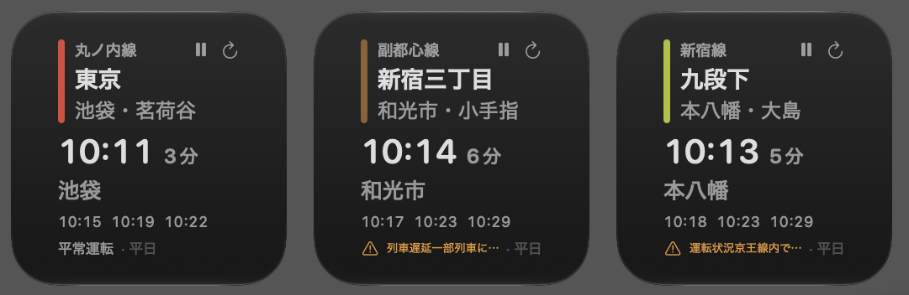

# 東京地下鉄ウィジェット

都営地下鉄と東京メトロの次発時刻・残り時間と運行状況を表示する macOS ウィジェットです。
[都バス接近情報ウィジェット](https://github.com/shigeya-t/tobus-widget) と同じ構成
（WidgetKit ウィジェット + メニューバー常駐アプリ）で、[Yahoo!路線情報](https://transit.yahoo.co.jp/)
の公開 HTML を取得し、クライアント側で解析して表示します。



## できること

- 通知センター / デスクトップに置ける WidgetKit ウィジェット（小・中サイズ）
- 選んだ路線・駅・方面の **次発時刻と残り時間**、その後 2本（小） / 3本（中）
- 本日分が終わったら翌日の始発に切り替え（見出しで平日 / 土曜 / 日曜・祝日を明示）
- Yahoo!路線情報と同じ「平常運転 / 遅延」
- メニューバーに次発までの残り時間を常時表示
- APIキー等の登録は不要。Dock には出さない（メニューバーのみ）

次発の残り時間は在線位置ではなく **定刻 − 現在時刻** です。遅延時は運行状況で知らせ、
時刻そのものは定刻のまま出します。

デフォルトは丸ノ内線 **東京・池袋／茗荷谷方面** です。事業者は都営地下鉄と東京メトロに分かれています。

## 必要なもの

- macOS 14 以降
- Xcode 15 以降
- [XcodeGen](https://github.com/yonaskolb/XcodeGen)（`brew install xcodegen`）
- インターネット接続（初回ビルド時に SwiftSoup を取得します）

## ビルドと導入

いちばん確実なのはスクリプトです。

```sh
brew install xcodegen
xcodegen generate
./scripts/sync-team.sh
./scripts/test.sh
./scripts/deploy-local.sh                 # ~/Applications と build/ へ配置
```

`deploy-local.sh` は Team 付きで署名してから配置します。アドホック署名では AppIntents が解決できず、
ウィジェットがプレースホルダのまま止まります。証明書が複数あるときは
`DEVELOPMENT_TEAM=XXXXXXXXXX ./scripts/deploy-local.sh` です。

配置後、「ウィジェットを編集」の左一覧から **東京地下鉄運行情報** を追加してください。
一覧に出る名前は `.app` のファイル名です。濁点付きの日本語だとウィジェット拡張が起動しなくなるため、
この名前（濁点なし）にしています。

Xcode から動かす場合は、`xcodegen generate` と `./scripts/sync-team.sh` のあと、
Signing で `SubwayWidget` と `SubwayWidgetExtension` の Team を確認し、スキーム `SubwayWidget` で実行します。
メニューバーに次発までの残り時間が出ます。Dock には出ません。

常時使う場合は、システム設定 →「一般」→「ログイン項目」に登録しておくと便利です。

## 路線・駅・方面の選び方

メニューバーとウィジェット設定のどちらも、**事業者 → 路線 → 駅 → 方面** の順です。
駅はカタログ（都営4路線・東京メトロ9路線）から選ぶので、検索のための通信はしません。
方面名は駅ごとに異なり、時刻表の表見出しから取ります。路線を変えると、駅と方面は
その路線のデフォルト（丸ノ内線なら東京）に付け替わります。メニューバーもウィジェット設定も同じ規則です。

丸ノ内線は方南町支線（中野新橋・中野富士見町・方南町）を含み、中野坂上では3方面になります。
有楽町線と副都心線の和光市〜氷川台は Yahoo!路線情報上で共用の時刻表です。
丸ノ内線の新宿は JR・都営の新宿駅とは別ページ（Yahoo 駅 ID `29342`）です。

## 更新のしくみ

**このアプリはメニューバーに常駐します。** 常駐をやめるとウィジェットはほぼ更新されません。

取得はメニューバーアプリに一本化しており、**ウィジェット拡張は自分では通信しません。**
アプリが 60 秒ごとに運行状況を、駅×方面の時刻表は日をまたがない限り 1 日 1 回取り、
App Group 経由でウィジェットへ渡します。配置済みウィジェットが別の駅を出している場合もまとめて取ります。

使わない時間帯は「一時停止」でリクエストを止められます。「今すぐ更新」は一時停止中でも取得します。

## データソースについて

[Yahoo!路線情報](https://transit.yahoo.co.jp/) の公開ページを HTML として取得しています。
公式 API・オープンデータではありません。

| 用途 | URL |
| --- | --- |
| 駅時刻表 | `https://transit.yahoo.co.jp/timetable/{駅ID}/{方面ID}?kind={1\|2\|4}` |
| 運行情報 | `https://transit.yahoo.co.jp/diainfo/area/4` |
| 祝日 | `https://holidays-jp.github.io/api/v1/date.json` |

`kind` は 1=平日、2=土曜、4=日曜・祝日です。祝日判定に holidays-jp を使います。

**注意点**

- HTML 構造や駅・方面 ID は予告なく変わる可能性があります
- Yahoo! JAPAN の利用規約は自動取得を想定していません。このアプリは **個人の私的利用** を想定しています
- 運行情報・時刻は Yahoo!路線情報の掲載に合わせた目安で、実際の列車と異なることがあります
- 交通局・ODPT・LINEヤフーへこのアプリの不具合を問い合わせないでください

## 構成

```
project.yml                  XcodeGen のプロジェクト定義
Shared/
  ToeiCatalog.swift            路線定義と都営の駅カタログ（メトロもここから参照）
  MetroCatalog.swift           東京メトロ9路線の駅カタログ
  ToeiConfig.swift             タイムゾーン・ダイヤ区分
  TrainModels.swift            便・時刻表・運行状況
  ToeiAPI.swift                Yahoo!路線情報への HTTP GET
  ToeiPageParser.swift         SwiftSoup による HTML 解析
  TrainScheduleService.swift   時刻表の日次キャッシュ
  TrainStatusService.swift     運行状況の短時間キャッシュ
  HolidayChecker.swift         祝日判定
  SelectStationIntent.swift    ウィジェット設定（事業者→路線→駅→方面）
  RefreshTrainIntent.swift     更新・一時停止ボタン
  AppSettings.swift            App Group 経由の共有
App/                         メニューバー常駐アプリ
WidgetExtension/             ウィジェット本体（通信しない）
Tests/                       単体テストと HTML フィクスチャ
scripts/
  sync-team.sh               証明書から Team ID を書く
  test.sh
  deploy-local.sh
  generate-app-icon.swift    AppIcon 一式の再生成
build/                       最新の .app（gitignore。deploy-local.sh がコピー）
```

`Info.plist` と `*.entitlements` は `project.yml` から生成されるため、リポジトリには含めていません。
`Toei*.swift` の型名は当初都営専用だった名残で、中身は都営・メトロ共通です。

バンドル ID は `jp.shigeya.SubwayWidget` です。フォーク時は `project.yml` の
`bundleIdPrefix` / `PRODUCT_BUNDLE_IDENTIFIER` を書き換えてください。あわせて次は手で直します。

- `Shared/AppSettings.swift` の `Notification.Name(...)` 2つ
- `scripts/_common.sh` の `BUNDLE_ID`

App Group は `$(DEVELOPMENT_TEAM).jp.shigeya.SubwayWidget` です。Team を入れれば追従します。

## ライセンス

[MIT License](LICENSE)

ライセンスが及ぶのはこのリポジトリのコードだけです。都営地下鉄・東京メトロの運行データ、および
Yahoo!路線情報・東京都交通局・東京地下鉄に対する権利は一切含みません。
